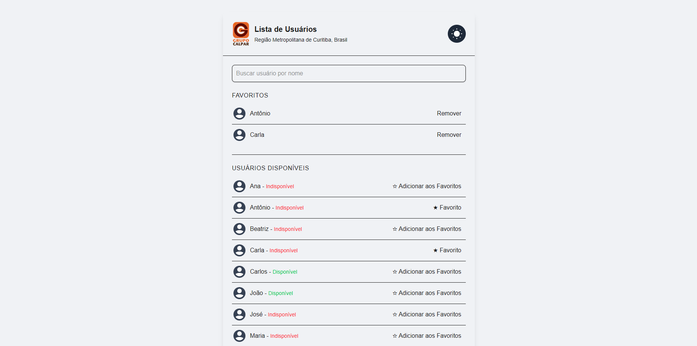
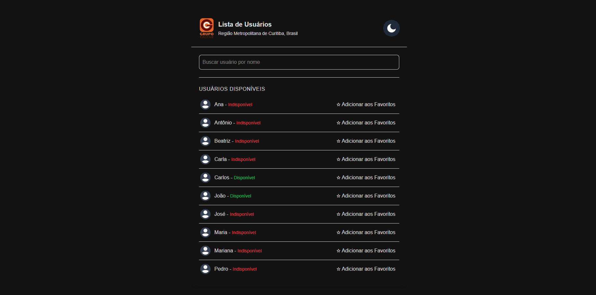

# Desafio de Programação da Calpar: Lista de Usuários

Este projeto é a minha solução para o desafio de programação da Calpar. Consiste em uma aplicação web desenvolvida com Next.js, TypeScript e Tailwind CSS, que consome uma API externa, exibe uma lista de usuários, permite a busca e gerenciamento de favoritos, e demonstra a integração com APIs nativas do navegador (Geolocalização e Armazenamento Local).

## Índice

- [Objetivo do Desafio](#objetivo-do-desafio)
- [Funcionalidades Implementadas](#funcionalidades-implementadas)
- [Tecnologias Utilizadas](#tecnologias-utilizadas)
- [Screenshots do Projeto](#screenshots-do-projeto)
- [Estrutura do Projeto](#estrutura-do-projeto)
- [Como Rodar o Projeto](#como-rodar-o-projeto)
  - [Pré-requisitos](#pré-requisitos)
  - [Rodar com Docker](#rodar-com-docker)
- [Decisões de Design e Boas Práticas](#decisões-de-design-e-boas-práticas)
- [Autor](#autor)

---

## Objetivo do Desafio

O principal objetivo do desafio era criar um projeto básico utilizando um framework web para demonstrar as seguintes habilidades:
- Consumo de API: `https://09441c3d-9208-4fa9-a576-ba237af6b17c.mock.pstmn.io/`
- Tratamento de mensagens de sucesso/erro da API.
- Integração com funcionalidades nativas do navegador.
- Boas práticas de programação e organização de código.

## Funcionalidades Implementadas

A aplicação oferece as seguintes funcionalidades:

-   **Consumo de API:** Busca uma lista de nomes de usuários e seus status de disponibilidade de uma API.
    -   Exibe mensagens de erro caso a API não retorne sucesso ou haja problemas de conexão.
-   **Listagem de Usuários:** Exibe os nomes e o status de disponibilidade (Disponível/Indisponível) de todos os usuários.
    -   A lista é exibida em ordem alfabética para melhor usabilidade.
-   **Barra de Pesquisa:** Permite ao usuário filtrar a lista de usuários por nome em tempo real, realizando uma busca insensível a maiúsculas/minúsculas.
-   **Gerenciamento de Favoritos (Local Storage):**
    -   Usuários podem ser adicionados ou removidos de uma lista de favoritos.
    -   A lista de favoritos é persistida no navegador utilizando a API `localStorage`, mantendo as preferências do usuário mesmo após fechar e reabrir o navegador.
    -   A lista de favoritos também é exibida em ordem alfabética.
-   **Alternância de Tema (Claro/Escuro):**
    -   Um botão na interface permite ao usuário alternar manualmente entre o modo claro e o modo escuro.
    -   A preferência de tema é salva no `localStorage` e carregada automaticamente na próxima visita.
    -   O tema também respeita a preferência do sistema operacional do usuário por padrão.
-   **Geolocalização Automática:**
    -   Ao carregar a página, a aplicação solicita a permissão de geolocalização do usuário.
    -   Após a permissão, ela exibe a cidade e o país do usuário (utilizando a API Nominatim do OpenStreetMap para geocodificação reversa).
    -   Mensagens de erro são exibidas caso a permissão seja negada ou a localização não possa ser obtida.
-   **Design Responsivo:** A interface se adapta a diferentes tamanhos de tela (mobile e desktop) utilizando Tailwind CSS.
-   **Otimização de Imagens:** Utiliza o componente `<Image />` do Next.js para otimização automática de imagens (lazy loading, redimensionamento, formatos modernos).

## Tecnologias Utilizadas

-   **Framework:** [Next.js](https://nextjs.org/)
-   **Linguagem:** [TypeScript](https://www.typescriptlang.org/)
-   **Estilização:** [Tailwind CSS](https://tailwindcss.com/)
-   **API Externa:** [Nominatim OpenStreetMap](https://nominatim.openstreetmap.org/ui/reverse.html) (para geocodificação reversa)
-   **Outras APIs Web Nativas:** `localStorage` e `navigator.geolocation`
-   **Gerenciador de Pacotes:** npm
-   **Contêineres:** [Docker](https://www.docker.com/) e [Docker Compose](https://docs.docker.com/compose/)

## Screenshots do Projeto

### Modo Claro


### Modo Escuro


## Estrutura do Projeto

A organização do projeto segue as melhores práticas do Next.js:

* `.`
    * `app/`: Diretório principal da aplicação (App Router). Contém o core da sua aplicação web.
        * `components/`: Contém todos os componentes React reutilizáveis e modulares, cada um com uma responsabilidade específica para manter o código limpo e organizado.
            * `BarraPesquisa.tsx`: Componente responsável pela UI e lógica da barra de busca de usuários.
            * `ListaFavoritos.tsx`: Componente que exibe e gerencia a lista de usuários favoritos do usuário.
            * `ListaUsuarios.tsx`: Componente responsável por exibir a lista principal de usuários disponíveis.
            * `MudarTema.tsx`: Componente `Provider` que gerencia o estado do tema (claro/escuro) e fornece o contexto para toda a aplicação.
            * `types.ts`: Arquivo centralizado para definições de interfaces TypeScript, garantindo consistência de tipo em todo o projeto.
        * `globals.css`: Arquivo de estilos CSS globais.
        * `layout.tsx`: O layout raiz da aplicação Next.js.
        * `page.tsx`: A página principal da aplicação.
    * `public/`: Contém todos os arquivos estáticos que são servidos diretamente pelo Next.js.
    * `Dockerfile`: Contém as instruções para construir a imagem Docker da sua aplicação.
    * `docker-compose.yml`: Arquivo de configuração para o Docker Compose.
    * `.dockerignore`: Lista de arquivos e diretórios que devem ser ignorados pelo Docker.
    * `next.config.mjs`: Arquivo de configuração para o Next.js.
    * `package.json`: Contém os metadados do projeto.
    * `postcss.config.mjs`: Configuração para o PostCSS.
    * `tailwind.config.ts`: Arquivo de configuração do Tailwind CSS.
    * `tsconfig.json`: Arquivo de configuração do TypeScript para o projeto,.
    * `README.md`: Este arquivo de documentação do projeto.

## Como Rodar o Projeto

Você pode rodar o projeto utilizando Docker. 

### Pré-requisitos

-   **Git:** Para clonar o repositório
-   **Docker Desktop:** (Recomendado para a abordagem com Docker)

### Rodar com Docker

1.  **Certifique-se de que o Docker Desktop está instalado e em execução** em sua máquina.
2.  **Clone o repositório:**
    ```bash
    git clone https://github.com/pedro-ft/desafio-calpar.git
    cd desafio-calpar
    ```
3.  **Construa a imagem Docker:**
    ```bash
    docker-compose build
    ```
4.  **Inicie a aplicação em contêineres:**
    ```bash
    docker-compose up -d
    ```
5.  **Acesse a aplicação:**
    Abra seu navegador e navegue para `http://localhost:3000`.
    
6.  **Para parar a aplicação e remover os contêineres:**
    ```bash
    docker-compose down
    ```

## Decisões de Design e Boas Práticas

-   **Next.js:**: A escolha do Next.js alinha-se com o framework principal utilizado na Calpar, demonstrando familiaridade e compatibilidade com o stack tecnológico da empresa.
-   **TypeScript:** Melhora a detecção de erros em tempo de desenvolvimento, a clareza do código e a manutenibilidade em projetos maiores.
-   **Tailwind CSS:** Selecionado para a estilização devido à sua velocidade de desenvolvimento, consistência de design e facilidade para implementar funcionalidades como Tema Claro/Escuro.
-   **Componentização:** O código foi modularizado em componentes menores (`SearchBar`, `ListaUsuarios`, `ListaFavoritos`, `MudarTema`, `types`) para promover a separação de responsabilidades, reutilização de código e facilidade de manutenção.
-   **Gerenciamento de Estado:** Utiliza os `Hooks` de `useState` e `useEffect` do React para gerenciar o estado local e efeitos colaterais (chamadas de API, `localStorage`, APIs do navegador).
-   **Tratamento de Erros:** As requisições de API e APIs nativas do navegador incluem blocos `try-catch` e mensagens de erro para o usuário.
-   **Otimização de Imagens:** Todas as imagens estáticas são servidas através do componente `<Image />` do `next/image` para otimização automática.
-   **Ordenação Alfabética:** As listas de usuários e favoritos são automaticamente ordenadas em ordem alfabética para melhorar a usabilidade.
-   **API Nominatim para Geocodificação Reversa:** Optou-se por esta API devido sua natureza de código aberto e por não exigir uma chave de API, o que simplifica a configuração do projeto.
-   **Dockerização:** O projeto é dockerizado para garantir um ambiente de execução consistente e simplificado, facilitando o build e o deploy em qualquer sistema.

## Autor

Pedro Ferreira Taborda

---
